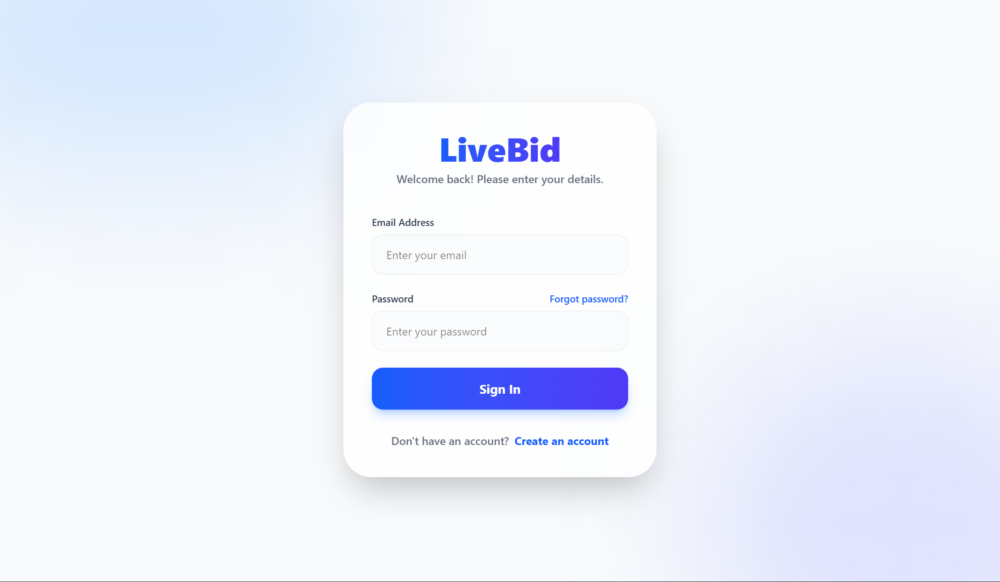
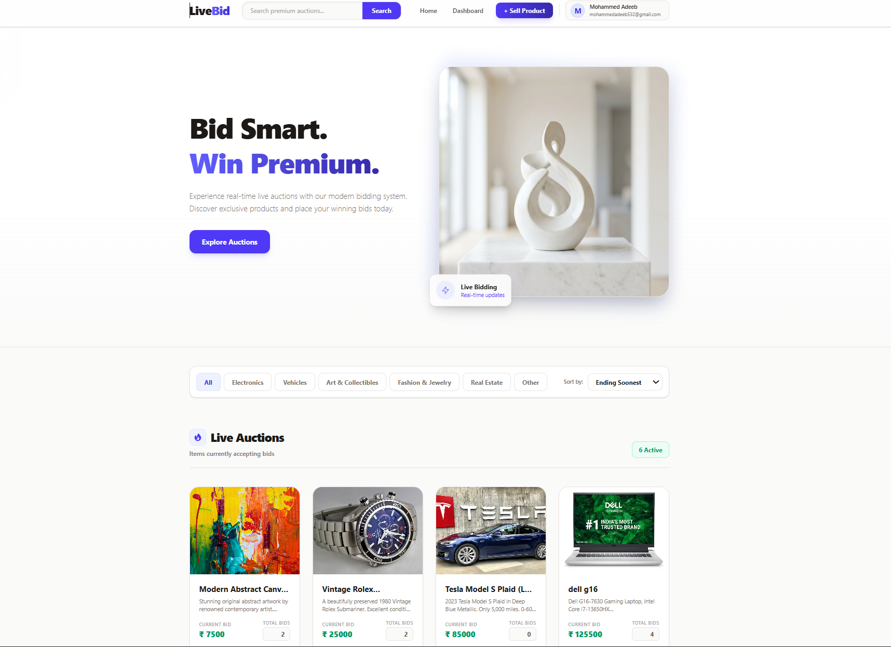
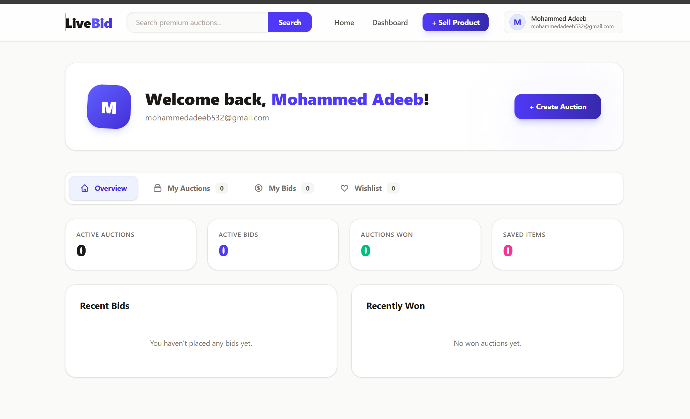

<div align="center">

# 🚀 LiveBid — Real-Time Auction Platform

### *A Full-Stack Real-Time Bidding Marketplace Built with MERN + Socket.IO*


</div>

---

# 🔒 PROJECT OVERVIEW

**LiveBid** is a real-time online auction platform where users can securely register, log in, create auctions, and participate in live bidding sessions.

The platform supports **real-time bid updates using Socket.IO**, secure authentication, auction management, and responsive UI for a seamless bidding experience.

---

# 🌐 LIVE DEPLOYMENT

### 🔗 Live Website
PASTE_YOUR_VERCEL_URL

### ⚙️ Backend API
PASTE_YOUR_RENDER_URL

### 💻 GitHub Repository
PASTE_YOUR_GITHUB_REPO

---

# ✨ KEY FEATURES

✅ Secure Authentication (Login / Signup)

✅ Real-Time Bidding using Socket.IO

✅ Auction Creation & Management

✅ Live Bid Updates

✅ Responsive User Interface

✅ MongoDB Database Integration

✅ REST API Architecture

✅ Cloud Deployment Ready

---

# 🛠️ TECH STACK

## Frontend
- React.js
- Vite
- Axios
- Socket.IO Client
- CSS

## Backend
- Node.js
- Express.js
- Socket.IO
- JWT Authentication

## Database
- MongoDB
- Mongoose

## Deployment
- Vercel (Frontend)
- Render (Backend)

---

# 🧠 SYSTEM ARCHITECTURE

```text
livebid-app/
│── client/
│   ├── src/
│   ├── public/
│   ├── package.json
│
│── server/
│   ├── controllers/
│   ├── models/
│   ├── routes/
│   ├── uploads/
│   ├── server.js
│   └── package.json
│
└── README.md
```

---

# 📦 INSTALLATION GUIDE

## 1️⃣ Clone Repository

```bash
git clone YOUR_GITHUB_URL
```

---

## 2️⃣ Install Frontend

```bash
cd client
npm install
npm run dev
```

---

## 3️⃣ Install Backend

```bash
cd server
npm install
node server.js
```

---

# ⚙️ ENVIRONMENT VARIABLES

Create `.env` file inside the `server/` folder.

```env
MONGO_URI=your_mongodb_connection
JWT_SECRET=your_secret_key
PORT=5000
```

---

# 🚀 DEPLOYMENT

| Service | Platform |
|----------|----------|
| Frontend | Vercel |
| Backend | Render |
| Database | MongoDB Atlas |

---

# 📸 APPLICATION PREVIEW

## 🔐 Login Screen



---

## 📊 Dashboard



---

## 💰 Live Auction / Bidding


# 🔮 FUTURE IMPROVEMENTS

- Payment Gateway Integration
- Admin Dashboard
- Auction Analytics
- Bid Notifications
- AI Price Prediction

---

# 👨‍💻 DEVELOPER

### Mohammed Adeeb

**Full Stack Developer | MERN Stack | Real-Time Systems**

GitHub: YOUR_GITHUB_PROFILE

---

<div align="center">

### ⭐ If you like this project, give it a star!

</div>
